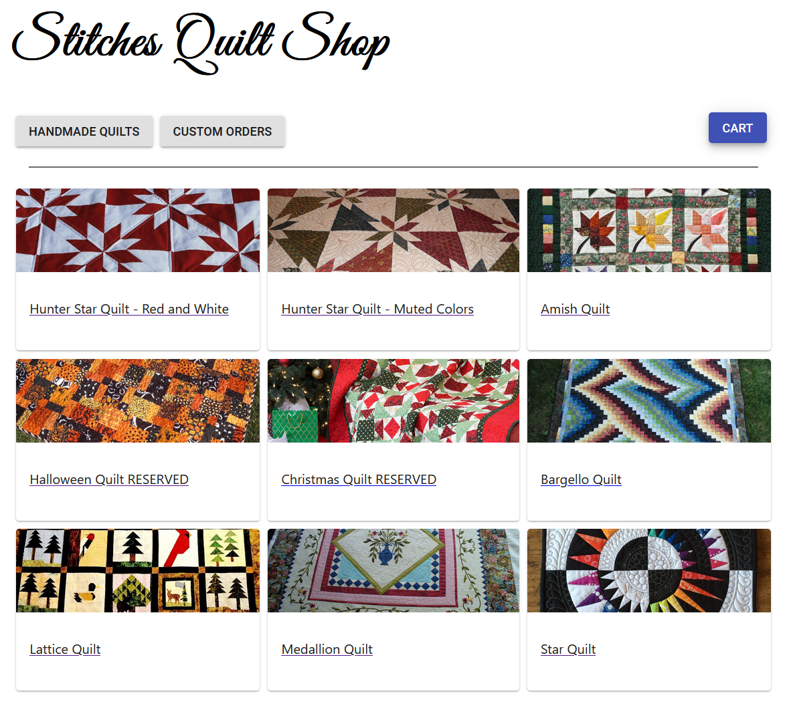
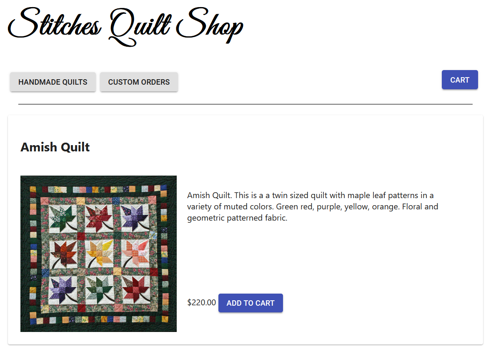
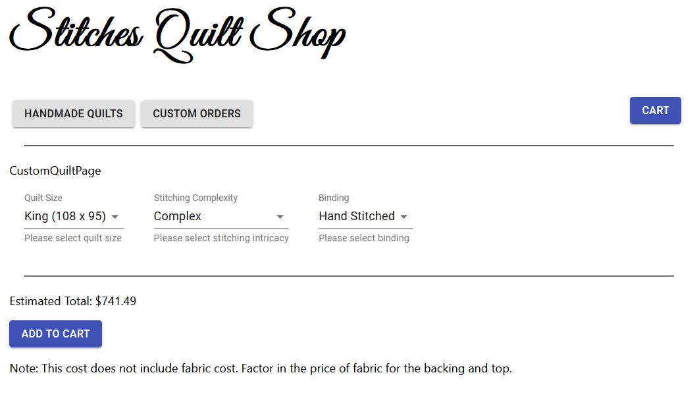
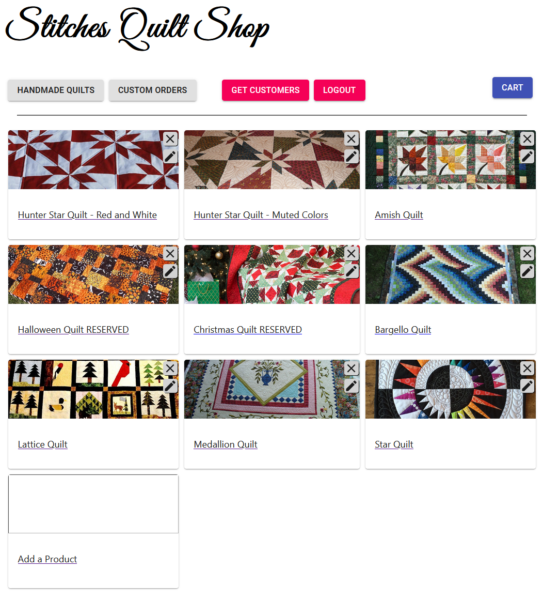
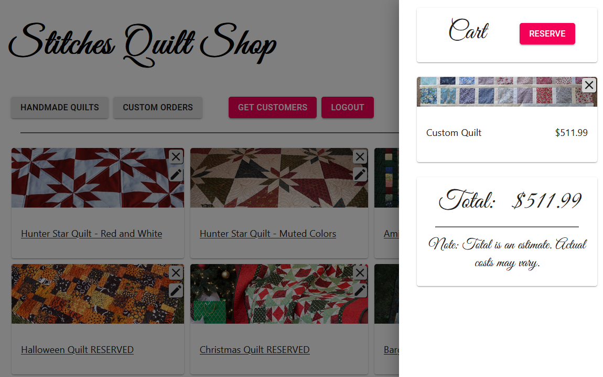

# Quiltshop
https://quiltshop.herokuapp.com/

## Table of Contents
* [Introduction](#Introduction)
* [Features](#Features)
* [Technologies](#Technologies)
* [Images](#Images)
* [Links](#Links)
* [Inspiration](#Inspiration)
* [Backend Setup](#Backend-Setup)
* [Frontend Setup](#Frontend-Setup)



## Introduction
>Quiltshop is a fullstack storefront web application that showcases quilts available for purchase.

## Features
* Shopping Cart (using local storage)
* Customers can add quilts to their cart, reserving the quilt for a period of time.
* Custom quilt orders can be estimated based on size, stitching complexity, and binding options.
* Custom quilt orders can also be added to the cart.
* Customers can request the contents of their cart in place of checking out.
* User contact information is stored in the database on checkout.
* The shop owner is immediately notified via email that a customer has an order, using SendGrid's API.
* The email contains the requested products, contact information and the estimated total given to the customer.
* The shop owner can login to add new products, edit existing products, or remove products directly from the main page.

## Technologies
* ReactJS
* Material UI
* Django
* Django Rest Framework
* JSON Web Tokens
* SendGrid API
* UPS Address Validator API
* PostgreSQL on deployed version, SQLite3 in this version

## Images





## Links
Frontend:
>https://quiltshop.herokuapp.com/
Backend:
>https://quiltshop-backend.herokuapp.com/

## Inspiration
A very close family member is starting a quilting business. This project is a prototype for her.

## Backend Setup
* In quiltshop/backend, start a virtual environment
* Install required modules
```
pip install -r requirements.txt
```
* Run Django
```
python manage.py runserver
```
* The server is now running on port 8000

## Frontend Setup
* Install required packages
```
npm install
```
* Start the React app
```
npm start
```
